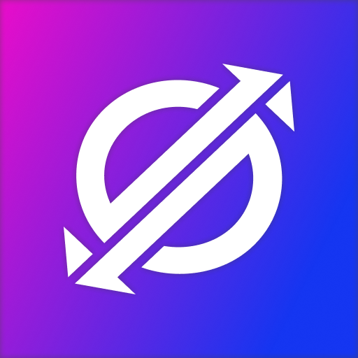

<div id="top"></div>

<!-- PROJECT SHIELDS -->
<!--
*** I'm using markdown "reference style" links for readability.
*** Reference links are enclosed in brackets [ ] instead of parentheses ( ).
*** See the bottom of this document for the declaration of the reference variables
*** for contributors-url, forks-url, etc. This is an optional, concise syntax you may use.
*** https://www.markdownguide.org/basic-syntax/#reference-style-links
-->

<div align="center">

[![Contributors][contributors-shield]][contributors-url]
[![Forks][forks-shield]][forks-url]
[![Stargazers][stars-shield]][stars-url]
[![Issues][issues-shield]][issues-url]
[![MIT License][license-shield]][license-url]

</div>

<!-- PROJECT LOGO -->
<br />
<div align="center">
  <a href="https://github.com/0xAndrewBlack/issue-bot">
    
  </a>

  <h3 align="center">Issue BOT</h3>

  <p align="center">
    An awesome Discord BOT to sync your projects!
    <br />
    <a href="https://github.com/0xAndrewBlack/issue-bot"><strong>Explore the docs »</strong></a>
    <br />
    <br />
    <a href="https://github.com/0xAndrewBlack/issue-bot">View Demo</a>
    ·
    <a href="https://github.com/0xAndrewBlack/issue-bot/issues">Report Bug</a>
    ·
    <a href="https://github.com/0xAndrewBlack/issue-bot/issues">Request Feature</a>
  </p>
</div>

<!-- TABLE OF CONTENTS -->
<details>
  <summary>Table of Contents</summary>
  <ol>
    <li>
      <a href="#about-the-project">About The Project</a>
      <ul>
        <li><a href="#built-with">Built With</a></li>
      </ul>
    </li>
    <li><a href="#usage">Usage</a></li>
    <li><a href="#roadmap">Roadmap</a></li>
    <li><a href="#contributing">Contributing</a></li>
    <li><a href="#license">License</a></li>
    <li><a href="#contact">Contact</a></li>
    <li><a href="#acknowledgments">Acknowledgments</a></li>
  </ol>
</details>

<!-- ABOUT THE PROJECT -->
## ℹ️ About The Project

Simple BOT to sync your Discord Threads with a GitHub repository and it's corresponding Issues and kanban Projects table.

<p align="right">(<a href="#top">back to top</a>)</p>

### 🔨 Built With

The project is built with a few packages.

- `discordx` - https://www.npmjs.com/package/discordx
- `discord.js` - https://www.npmjs.com/package/discord.js
- `octokit` - https://www.npmjs.com/package/@octokit/rest
- `prisma` - https://www.npmjs.com/package/prisma

<p align="right">(<a href="#top">back to top</a>)</p>

## 💨 Running the code

Install dependencies
```bash
npm install
```

Run the bot
```bash
npm start
```

<!-- CONTRIBUTING -->
## 🙌 Contributing

Contributions are what makes the open source community such an amazing place to learn, inspire, and create. Any contributions you make are **greatly appreciated**.

If you have a suggestion that would make this better, please fork the repo and create a pull request. You can also simply open an issue with the tag "enhancement".

Refer to using conventional commits.

Don't forget to give the project a star! Thanks again!

1. Fork the Project
2. Create your Feature Branch (`git checkout -b feature/AmazingFeature`)
3. Commit your changes (`git commit -m '✨ feat: Add some AmazingFeature'`)
4. Push to the Branch (`git push origin feature/AmazingFeature`)
5. Open a Pull Request
6. Wait. :D

<p align="right">(<a href="#top">back to top</a>)</p>

<!-- LICENSE -->
## 🎗️ License

Distributed under the MIT License. See `LICENSE.md` for more information.

<p align="right">(<a href="#top">back to top</a>)</p>

<!-- CONTACT -->
## ✉️ Contact

Andrew Black / Andras Fekete - [@itslemonandrew](https://twitter.com/itslemonandrew) - andras@fekete.io

Project Link: [https://github.com/0xAndrewBlack/issue-bot](https://github.com/0xAndrewBlack/issue-bot)

<p align="right">(<a href="#top">back to top</a>)</p>

<!-- ACKNOWLEDGMENTS -->
## 😎 Acknowledgments

Use this space to list resources you find helpful and would like to give credit to. 
I've included a few of my favorites to kick things off!

* [README Template](https://github.com/0xAndrewBlack/issue-bot) - Readme template
* [Choose an Open Source License](https://choosealicense.com) - License template
* [GitHub Emoji Cheat Sheet](https://www.webpagefx.com/tools/emoji-cheat-sheet) - Emojis

<p align="right">(<a href="#top">back to top</a>)</p>

<!-- MARKDOWN LINKS & IMAGES -->
<!-- https://www.markdownguide.org/basic-syntax/#reference-style-links -->
[contributors-shield]: https://img.shields.io/github/contributors/0xAndrewBlack/issue-bot.svg?style=for-the-badge
[contributors-url]: https://github.com/0xAndrewBlack/issue-bot/graphs/contributors
[forks-shield]: https://img.shields.io/github/forks/0xAndrewBlack/issue-bot.svg?style=for-the-badge
[forks-url]: https://github.com/0xAndrewBlack/issue-bot/network/members
[stars-shield]: https://img.shields.io/github/stars/0xAndrewBlack/issue-bot.svg?style=for-the-badge
[stars-url]: https://github.com/0xAndrewBlack/issue-bot/stargazers
[issues-shield]: https://img.shields.io/github/issues/0xAndrewBlack/issue-bot.svg?style=for-the-badge
[issues-url]: https://github.com/0xAndrewBlack/issue-bot/issues
[license-shield]: https://img.shields.io/github/license/0xAndrewBlack/issue-bot.svg?style=for-the-badge
[license-url]: https://github.com/0xAndrewBlack/issue-bot/blob/master/LICENSE.md